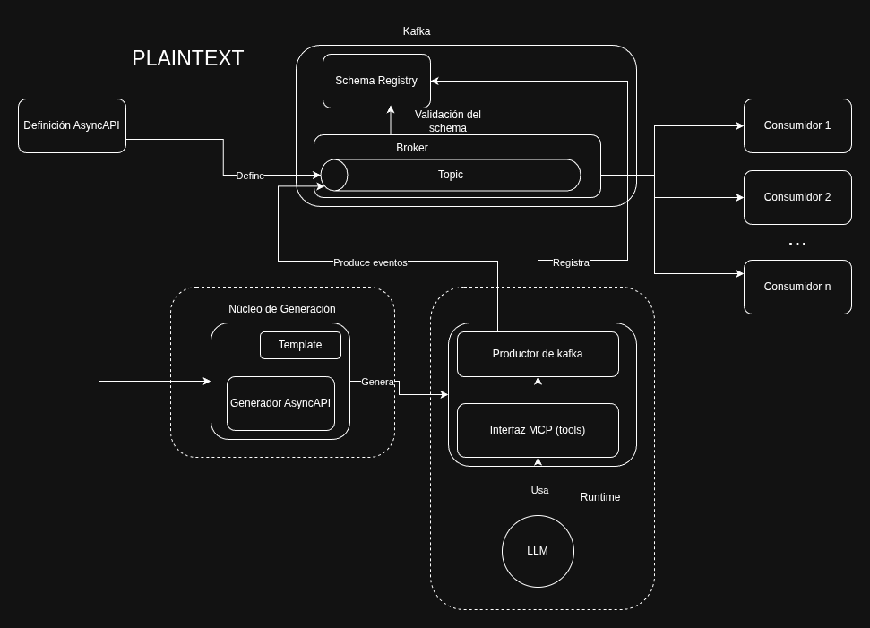
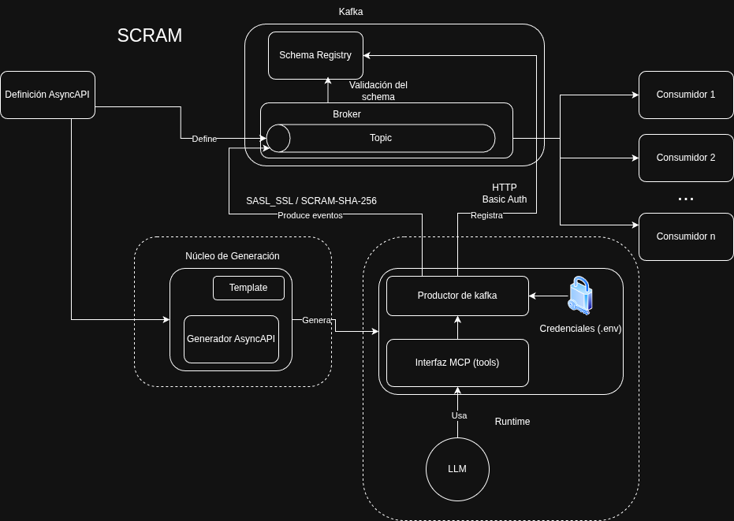
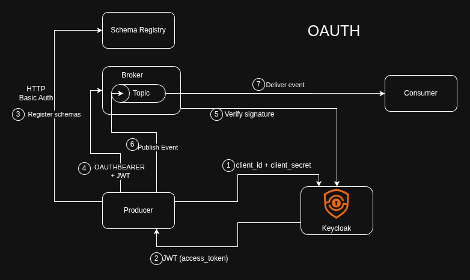

# AsyncAPI MCP Kafka Generator

Custom AsyncAPI generator template that automatically produces a **Model Context Protocol (MCP)** server in Python from an AsyncAPI v3 specification.

The goal is to let LLMs (Claude, Cursor, etc.) interact with a Kafka-based event architecture using the AsyncAPI spec as the single source of truth.

---

## How it works

```
AsyncAPI spec (.yaml)
        │
        ▼
AsyncAPI Generator + template/
        │
        ▼
generated-code/
  ├── mcp_server.py     ← FastMCP server with one @mcp.tool per send operation
  └── kafka_producer.py ← Confluent Kafka producer with Schema Registry
```

For each `send` operation defined in the spec, the generator creates a typed Python function decorated with `@mcp.tool`. The function validates and serializes the payload against a JSON Schema extracted from the spec, then produces the message to the corresponding Kafka topic.

The security configuration (broker host, authentication scheme) is read from the `servers[]` section of the spec and embedded directly into the generated code.

---

## Project structure

```
.
├── template/
│   ├── mcp_server.js              # Dynamic template (AsyncAPI React SDK) → generates mcp_server.py
│   └── kafka_producer.py          # Static file — copied as-is to generated-code/
├── yaml/                          # AsyncAPI v3 spec examples
│   ├── streets-lights.yaml        # PLAINTEXT + SCRAM-SHA-256 servers
│   ├── streets-lights-oauth.yaml  # OAuth2 client_credentials server
│   └── temperature.yaml           # IoT temperature sensors, PLAINTEXT
├── generated-code/                # Output of the generator (gitignored — regenerate as needed)
│   ├── mcp_server.py
│   └── kafka_producer.py
├── consumer/                      # Standalone Kafka consumer for testing/observability
│   ├── kafka_consumer.py
│   └── run_consumer.py
├── docker/                        # Local dev environment
│   ├── docker-compose.yml         # Kafka SASL_SSL (SCRAM) + Schema Registry (Basic Auth) + nginx
│   ├── docker-compose-plain.yml   # Kafka PLAINTEXT only — for quick local testing
│   ├── docker-compose-oauth.yml   # Kafka SASL_SSL (OAUTHBEARER) + Schema Registry (Basic Auth) + Keycloak
│   ├── keycloak-realm.example.json  # Keycloak realm config template (copy to keycloak-realm.json)
│   ├── gen-certs.sh               # Generates SSL certs for SASL_SSL listeners (run once)
│   ├── kafka-init.sh              # Creates SCRAM users at broker startup
│   └── launch.sh                  # Interactive launcher — choose which stack to bring up
├── api/                           # FastAPI service that wraps the generator (REST interface)
│   └── app.py
├── scripts/
│   ├── run_asyncapi_generator.sh  # Wrapper around asyncapi generate
│   └── run_mcp_inspector.sh       # Launches the MCP Inspector UI
├── package.json                   # AsyncAPI generator template config
└── pyproject.toml                 # Python dependencies (uv)
```

---

## Prerequisites

- **Node.js** (for the AsyncAPI generator)
- **Python ≥ 3.13** + **uv**
- **Docker + Docker Compose** (for the local Kafka stack)

Install the AsyncAPI generator and Python dependencies:

```bash
npm install
uv sync
```

---

## Generating the MCP server

Use the provided script, passing the spec file and optionally the server name:

```bash
./scripts/run_asyncapi_generator.sh yaml/streets-lights.yaml plain-connections
```

The `server` parameter selects which broker host and security scheme are embedded in the generated code. If omitted, the first server in the spec is used.

Available servers per spec:

| Spec | Server name | Security |
|------|-------------|----------|
| `streets-lights.yaml` | `plain-connections` | None (PLAINTEXT) |
| `streets-lights.yaml` | `scram-connections` | SCRAM-SHA-256 |
| `streets-lights-oauth.yaml` | `oauth-connections` | OAuth2 client_credentials |

---

## Local development environment

Launch the stack interactively:

```bash
cd docker/
bash launch.sh
```

Three stacks are available:

| Stack | Compose file | Port | Services |
|-------|-------------|------|----------|
| PLAINTEXT | `docker-compose-plain.yml` | 9092 | Kafka + Schema Registry (open) + kafka-ui |
| SCRAM | `docker-compose.yml` | 9095 | Kafka (SASL_SSL + SCRAM-SHA-256) + Schema Registry (Basic Auth) + kafka-ui + nginx |
| OAuth2 | `docker-compose-oauth.yml` | 9095 | Kafka (SASL_SSL + OAUTHBEARER) + Schema Registry (Basic Auth) + kafka-ui + Keycloak |





For the SCRAM and OAuth2 stacks, generate SSL certs first (only needed once):

```bash
cd docker/
bash gen-certs.sh
```

### OAuth2 / Keycloak setup

The OAuth2 stack requires a `docker/keycloak-realm.json` file (gitignored). Copy the example and set your client secret:

```bash
cp docker/keycloak-realm.example.json docker/keycloak-realm.json
# Edit keycloak-realm.json and replace "CHANGE_ME" with a real secret
```

The realm (`masorange`) and client (`mcp-app`) are imported automatically on first startup. No manual Keycloak configuration is needed.

---

## Running the generated MCP server

Configure `generated-code/.env` with the appropriate variables for your security scheme:

```env
SCHEMA_REGISTRY_URL=http://localhost:8081

# PLAINTEXT — no extra config needed

# SCRAM-SHA-256
KAFKA_USERNAME=testuser
KAFKA_PASSWORD=testpassword
KAFKA_SSL_CA_LOCATION=../docker/certs/ca.crt

# OAuth2 client_credentials
OAUTH_CLIENT_ID=mcp-app
OAUTH_CLIENT_SECRET=your-secret
OAUTH_TOKEN_URL=http://localhost:9090/realms/masorange/protocol/openid-connect/token

# Schema Registry Basic Auth (SCRAM and OAuth2 stacks only — not needed for PLAINTEXT)
SCHEMA_REGISTRY_USERNAME=admin
SCHEMA_REGISTRY_PASSWORD=testpassword
```

Run the server:

```bash
cd generated-code/
uv run fastmcp dev mcp_server.py   # development mode (MCP Inspector)
uv run mcp_server.py               # production mode
```

---

## Quick start by security scheme

### PLAINTEXT

No certificates or credentials needed.

```bash
# 1. Start the stack
cd docker && bash launch.sh   # option 1

# 2. Generate the MCP server
./scripts/run_asyncapi_generator.sh yaml/streets-lights.yaml plain-connections

# 3. Run
cd generated-code && uv run mcp_server.py
```

---

### SCRAM-SHA-256

```bash
# 1. Generate SSL certificates (broker only — run once)
cd docker && bash gen-certs.sh

# 2. Start the stack
bash launch.sh   # option 2

# 3. Generate the MCP server
./scripts/run_asyncapi_generator.sh yaml/streets-lights.yaml scram-connections

# 4. Configure generated-code/.env
KAFKA_USERNAME=testuser
KAFKA_PASSWORD=testpassword
KAFKA_SSL_CA_LOCATION=../docker/certs/ca.crt
SCHEMA_REGISTRY_URL=http://localhost:8081
SCHEMA_REGISTRY_USERNAME=admin
SCHEMA_REGISTRY_PASSWORD=testpassword

# 5. Run
cd generated-code && uv run mcp_server.py
```

---

### OAuth2 (client_credentials)

```bash
# 1. Set up the Keycloak realm
cp docker/keycloak-realm.example.json docker/keycloak-realm.json
# Edit keycloak-realm.json and replace "CHANGE_ME" with a real client secret

# 2. Generate SSL certificates (broker only — run once)
cd docker && bash gen-certs.sh

# 3. Start the stack
bash launch.sh   # option 3

# 4. Generate the MCP server
./scripts/run_asyncapi_generator.sh yaml/streets-lights-oauth.yaml oauth-connections

# 5. Configure generated-code/.env
KAFKA_SSL_CA_LOCATION=../docker/certs/ca.crt
SCHEMA_REGISTRY_URL=http://localhost:8081
SCHEMA_REGISTRY_USERNAME=admin
SCHEMA_REGISTRY_PASSWORD=testpassword
OAUTH_CLIENT_ID=mcp-app
OAUTH_CLIENT_SECRET=<your-secret>
OAUTH_TOKEN_URL=http://localhost:9090/realms/masorange/protocol/openid-connect/token

# 6. Run
cd generated-code && uv run mcp_server.py
```

---

## Security support

Security configuration is read from the spec's `servers[].security` field and embedded in the generated `mcp_server.py`.

| AsyncAPI scheme | Kafka protocol | Authentication |
|-----------------|---------------|----------------|
| _(none)_ | PLAINTEXT | None |
| `scramSha256` | SASL_SSL | SCRAM-SHA-256 (username + password) |
| `oauth2` / `clientCredentials` | SASL_SSL | OAUTHBEARER — token fetched M2M via client secret |

### OAuth2 client_credentials flow

The MCP server authenticates directly against Keycloak using a `client_id` + `client_secret`. No human interaction is required — the token is fetched automatically in the background whenever the Kafka client needs one. The Kafka broker validates the JWT signature against Keycloak's JWKS endpoint and checks the `iss` and `aud` claims.

This is the natural fit for an MCP server: the producer is an automated service with its own application identity, not a human user.



---

## AsyncAPI spec features used

### Path parameters

Channel address parameters (e.g. `{streetlightId}`) are extracted and exposed as function arguments. The first path param is used as the Kafka partition key by default.

### Custom partition key (`x-kafka-key`)

Override the partition key field with the `x-kafka-key` extension on an operation:

```yaml
operations:
  sendReading:
    action: send
    x-kafka-key: sensorId
    channel:
      $ref: '#/channels/readingsChannel'
```

### Optional fields

Payload properties not listed under `required` are generated as `Optional[T] = None` and filtered out before sending.

### Docstrings

Generated tool functions include docstrings built from `summary`, `description`, and property `description` fields in the spec.

---

## Consuming events (observability)

A simple consumer is provided for testing. Configure it via `consumer/.env`:

```env
KAFKA_BOOTSTRAP_SERVERS=localhost:9095
TOPICS=smartylighting.streetlights.1.0.action.home.turn.on
CONSUMER_GROUP_ID=streetlights-logger
KAFKA_USERNAME=testuser
KAFKA_PASSWORD=testpassword
KAFKA_SSL_CA_LOCATION=../docker/certs/ca.crt
```

```bash
cd consumer/
uv run run_consumer.py
```

---

## Example specs

| File | Servers | Description |
|------|---------|-------------|
| `yaml/streets-lights.yaml` | `plain-connections` (9092), `scram-connections` (9095) | Streetlights API — path params, PLAINTEXT and SCRAM |
| `yaml/streets-lights-oauth.yaml` | `oauth-connections` (9095) | Streetlights API — OAuth2 client_credentials |
| `yaml/temperature.yaml` | _(plain)_ | IoT temperature sensors — required fields, no auth |
